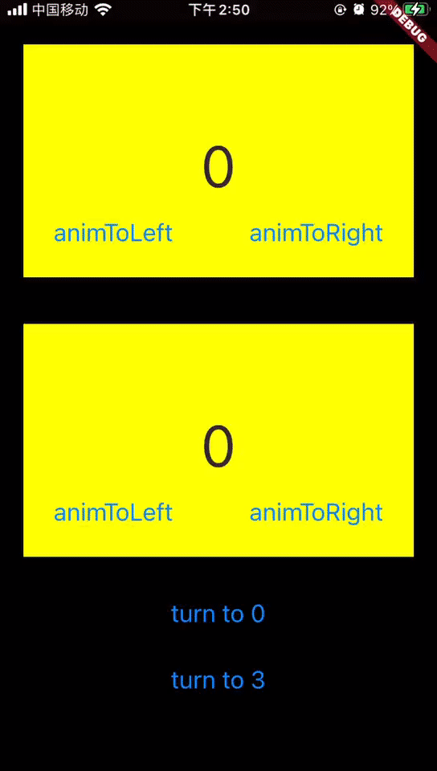

# better_page_turn

A simple Page Turn Widget for Flutter.



## Install Started

1. Add this to your **pubspec.yaml** file:

```yaml
dependencies:
  better_page_turn: ^0.0.6
```

2. Install it

```bash
$ flutter packages get
```

## Normal usage

```dart
Container(
  child: Padding(
    padding: EdgeInsets.all(20.0),
    child: LayoutBuilder(builder: (context, constraints) {
      return HorizontalFlipPageTurn(
        children: [
          _buildWidget(
            0,
            Colors.yellowAccent,
            horizontalFlipPageTurnController.animToLeftWidget,
            horizontalFlipPageTurnController.animToRightWidget,
          ),
          _buildWidget(
            1,
            Colors.purpleAccent,
            horizontalFlipPageTurnController.animToLeftWidget,
            horizontalFlipPageTurnController.animToRightWidget,
          ),
          _buildWidget(
            2,
            Colors.greenAccent,
            horizontalFlipPageTurnController.animToLeftWidget,
            horizontalFlipPageTurnController.animToRightWidget,
          ),
        ],
        cellSize: Size(constraints.maxWidth, 200),
        controller: horizontalFlipPageTurnController,
      );
    }),
  ),
),
```
